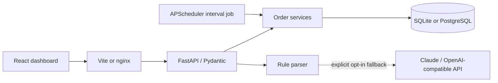

# Architecture and design decisions

## Request flow

The React dashboard calls a same-origin REST API through Vite's local proxy or nginx in Compose. FastAPI validates a Pydantic request, calls a small service layer and commits through a request-scoped SQLAlchemy session. Orders and items are inserted in one transaction. SQLite and PostgreSQL use the same models and business rules.

The application factory owns database and scheduler dependencies. FastAPI lifespan initializes tables, starts the scheduler and shuts down cleanly. Environment settings are injectable for tests. A separate repository abstraction was not added because SQLAlchemy already provides a unit of work and the data access is small and explicit.

## Persistence and concurrency

Orders have UUIDs, customer IDs, status, integer-cent totals, UTC timestamps and an integer version. Items retain an order's product IDs, quantities and price snapshots. Database checks enforce positive quantities/prices and valid statuses; foreign keys protect relationships. Status/creation time are indexed. Relationships use select-in loading to avoid one query per order.

A state change checks the current status and executes an atomic UPDATE with predicates on order ID, status and version. If another request or the scheduler wins first, zero rows change and the client receives 409. The UI sends its observed version and refreshes details after a conflict. SQLite uses WAL and a busy timeout for small local workloads; PostgreSQL is the concurrent deployment choice.

The job uses a conditional bulk UPDATE for only PENDING rows, increments versions and commits once. A simultaneous cancellation cannot turn a processing order into cancelled or resurrect a cancelled order. The in-process APScheduler job has coalescing and max_instances=1. One Uvicorn worker is used by the supplied Dockerfile. Multiple schedulers would still produce safe state changes, but an independent worker with a distributed lock should coordinate larger deployments. The job does not guarantee exactly-once external side effects; there are no external fulfillment side effects here.

Orders pending while the app is offline remain in the database. The interval schedule starts afresh on startup; the next tick processes them. For larger backlogs use bounded batches and a dedicated worker. The current returning-ID bulk update materializes changed IDs and is sized for an assignment workload.

## API semantics

Requests reject extra fields and invalid limits. Create returns 201 with a Location header. Read-missing returns 404; invalid input returns 422; invalid/stale transitions return 409. Database and provider failures are sanitized. Problems use application/problem+json with type, title, status, detail and instance; validation adds structured errors. OpenAPI is available at /openapi.json and /docs.

A repeat of an already-applied state is an idempotent no-op, unless an explicitly supplied expected_version is stale. Creation has no idempotency key, so retrying a POST may create a second order. Lists have bounded offset pagination and deterministic sorting. Count and list are separate queries; concurrent writes can change the count between them. Cursor pagination and snapshot semantics are future options.

USD is the demo currency. Decimal input with at most two places becomes integer cents; amounts are serialized as strings. Maximum order totals fit signed 64-bit storage. No floating point is used in backend money calculations.

## AI boundary

Rules handle documented queries without network access. AI handles optional language translation only, never fulfillment or state changes. Strict Pydantic filters reject extra fields, invalid enums, invalid date/amount ranges and empty generated filters. Bound SQLAlchemy expressions keep query text out of SQL syntax. The UI identifies which parser handled a query and shows interpreted filters.

The API key remains server-side and is not exposed by /api/config. Network requests have a timeout and do not follow redirects. Provider base URLs are administrator configuration, not client input. Hosted AI is opt-in and may transmit identifying text if the user puts it into the query. Mocked tests exercise provider request/response handling; no live-model accuracy claim is made. A production service also needs authentication, quotas, query-length/body limits at the edge, rate limiting and provider-specific cost controls.

## Deliberate scope

create_all initializes a fresh database; it is not a migration strategy for future schema edits. Add Alembic before changing a deployed schema. Authentication, customer ownership, trusted catalog prices, inventory, payment workflows, audit events and full operational telemetry are outside this assignment. The supplied Compose service binds to localhost and uses a demo database credential. The frontend is optional to the backend requirement, but makes the workflow easy to review.
